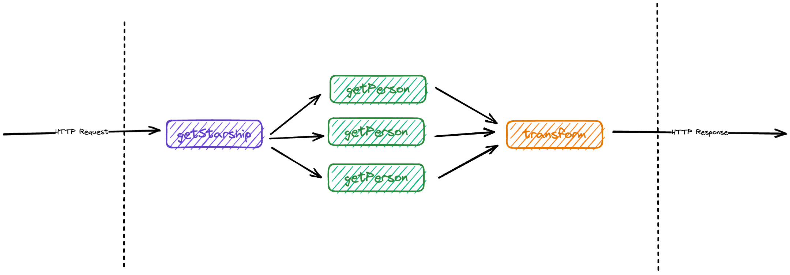
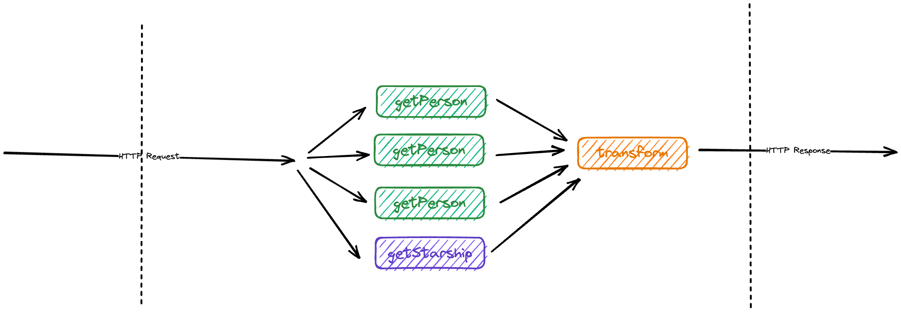

# rx-example

A Repo demonstrating how to use `rxjs` for async communcation.

## Problem Statement

A common problem is dealing with calls to multiple REST endpoints without blocking on a single one.

For this demonstration, we will use the StarWars API AKA [SWAPI](https://swapi.dev/).

Let's make a specific _requirement_:

> I would like to get a Starship from the Star Wars Universe and it should have passengers from the Star Wars Universe.

Now, we can do this the _traditional_ way:

  

The problem with this approach, is that we're really blocking on that call to get our _starship_.

We could use some clever `Promise` construction to alleviate this. But that can get messy, especially with the need to maybe `lock` on a common resource as while Node.js is _single threaded_, the underlying OS IO is potentially re-entrant.

With [`rxjs`](https://rxjs.dev/guide/operators) we can actually do something more like this:

  

Now, let's [look at the code!](./src/handlers/http/index.ts)
